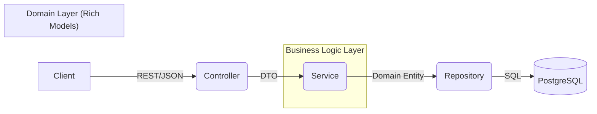

# 📦 Gestão de Pedidos API


Uma API robusta e escalável para o gerenciamento de ciclos de vida de pedidos, construída com foco em **integridade de domínio** e **previsibilidade de comportamento**.

## 🏗️ Arquitetura e Design

O projeto segue os princípios do **Domain-Driven Design (DDD)** e uma **Arquitetura em Camadas**, garantindo que a lógica de negócio seja isolada de preocupações de infraestrutura (como HTTP ou Banco de Dados).

### Fluxo de Requisição


### Pilares de Design
- **Rich Domain Model:** Diferente de modelos anêmicos, nossas entidades (`Pedido`, `Produto`) são responsáveis por suas próprias regras de transição de estado. Isso impede que um pedido entre em um estado impossível (ex: de `CANCELADO` para `ENTREGUE`).
- **Imutabilidade com Value Objects:** O uso de `Java Records` para tipos como `Email` e `Telefone` garante que, uma vez criados, os dados são imutáveis e sempre válidos.
- **Fail-Fast Principle:** As validações ocorrem o mais cedo possível (no construtor do Value Object ou via Bean Validation no DTO), evitando o processamento de dados corrompidos.

---

## 🧪 Estratégia de Qualidade (QA)

A confiança no sistema é garantida através de uma pirâmide de testes:

1.  **Testes Unitários (Domínio):** Focados em testar a lógica de negócio dentro dos Records e Entidades, garantindo que as regras de estado e validações funcionem isoladamente.
2.  **Testes de Integração (API):** Validam o fluxo completo, desde o endpoint REST até a persistência no banco de dados, garantindo a integridade das transações e das migrações do Flyway.

---

## 🚀 Funcionalidades Principais

- 🔄 **Ciclo de Vida de Pedidos:** Gestão de estados com estorno automático de estoque em caso de cancelamento.
- 🛡️ **Integridade de Estoque:** Proteção contra vendas de produtos com estoque insuficiente ou inativos.
- 📊 **Analytics Engine:** Endpoints de alta performance para relatórios de receita e métricas de vendas por período.
- 📑 **Versionamento de Schema:** Migrações controladas via Flyway para garantir consistência entre ambientes.

---

## 🛠️ Stack Tecnológica

| Tecnologia | Uso |
| :--- | :--- |
| **Java 21** | Linguagem base (LTS) |
| **Spring Boot 3** | Framework de aplicação |
| **PostgreSQL** | Persistência de dados relacional |
| **Flyway** | Evolução de schema (Database Migrations) |
| **Maven** | Gestão de build e dependências |
| **Jakarta Validation** | Garantia de integridade dos contratos |

---

## 📖 Guia de Uso

### 🛠️ Configuração Local

1. **Clone e Entre:**
   ```sh
   git clone <url-do-seu-repositorio> && cd gestao-de-pedidos
   ```

2. **Configuração do Banco:**
   Certifique-se de que o PostgreSQL está rodando e ajuste as credenciais em `src/main/resources/application.properties`.

3. **Execução:**
   ```sh
   mvn spring-boot:run
   ```

### 🔌 API Reference (Snippets)

**Endpoint de Criação de Pedido (`POST /pedidos`)**
*Respeita o padrão `snake_case`.*

```json
{
  "cliente_id": 1,
  "itens": [
    { "produto_id": 10, "quantidade": 5 }
  ]
}
```

---

## 🗺️ Roadmap de Evolução

- [ ] **Security:** Implementação de OAuth2/JWT para proteção de endpoints sensíveis.
- [ ] **Observability:** Integração com Micrometer e Prometheus para monitoramento de métricas.
- [ ] **DevOps:** Pipeline de CI/CD com testes automatizados e deploy via Docker.
```,file_path: